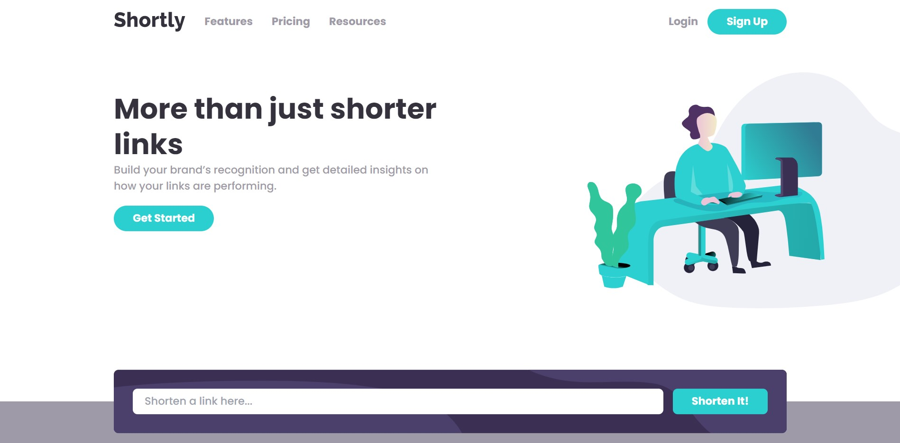

# Frontend Mentor - Shortly URL shortening API Challenge solution

This is a solution to the [Shortly URL shortening API Challenge challenge on Frontend Mentor](https://www.frontendmentor.io/challenges/url-shortening-api-landing-page-2ce3ob-G). Frontend Mentor challenges help you improve your coding skills by building realistic projects.

## Table of contents

- [Overview](#overview)
  - [The challenge](#the-challenge)
  - [Screenshot](#screenshot)
  - [Links](#links)
- [My process](#my-process)
  - [Built with](#built-with)
  - [What I learned](#what-i-learned)
- [Author](#author)

## Overview

### The challenge

Users should be able to:

- View the optimal layout for the site depending on their device's screen size
- Shorten any valid URL
- See a list of their shortened links, even after refreshing the browser
- Copy the shortened link to their clipboard in a single click
- Receive an error message when the `form` is submitted if:
  - The `input` field is empty

### Screenshot

### Links

- Solution URL: [GitHub](https://github.com/8xMohab/url-shortening-api)
- Live Site URL: [GitPages](https://8xMohab.github.io/url-shortening-api)

## My process

 Api wise I used RTK-query to send the POST resquest and then dispatched the response data to [Url slice](./src/features/url/urlSlice.js)
 after that I used [Url List](./src/features/url/UrlList.jsx) to map over the urls and display them.

### Built with

- [React](https://reactjs.org/) - JS library
- [Redux](https://redux.js.org/) - State management JS library
- [React Router](https://reactrouter.com/) - Manage website pages
- [Tailwind CSS](https://tailwindcss.com/) - CSS framework
- [T.ly](https://t.ly/) - Url Shortner Api
- [Vite](https://vitejs.dev/) - JS build tool
- Mobile-first workflow

### What I learned

- I learned more about the APIs and how they work how to interact with their endpoints.
- Also learned about the Regular Expressions and used them to validate url input.
- Environment variables, what they are and how to use them to hide the api key. (although the browser is accessing it anyway but this is a free key and not that many people gonna review my page).

## Author

- Frontend Mentor - [@8xMohab](https://www.frontendmentor.io/profile/8xMohab)
- Twitter - [@8xMohab](https://www.twitter.com/8xMohab)